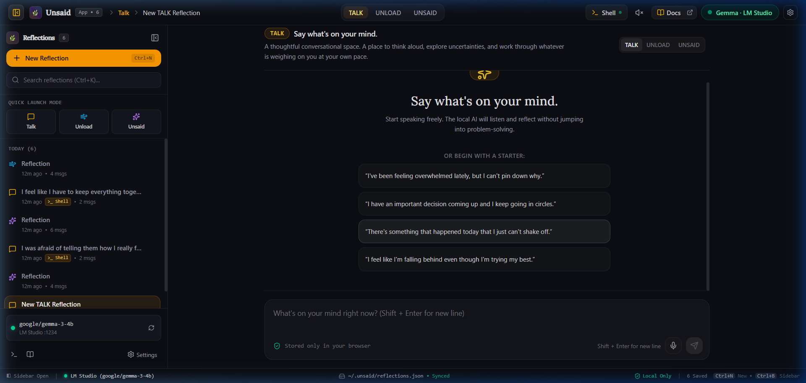
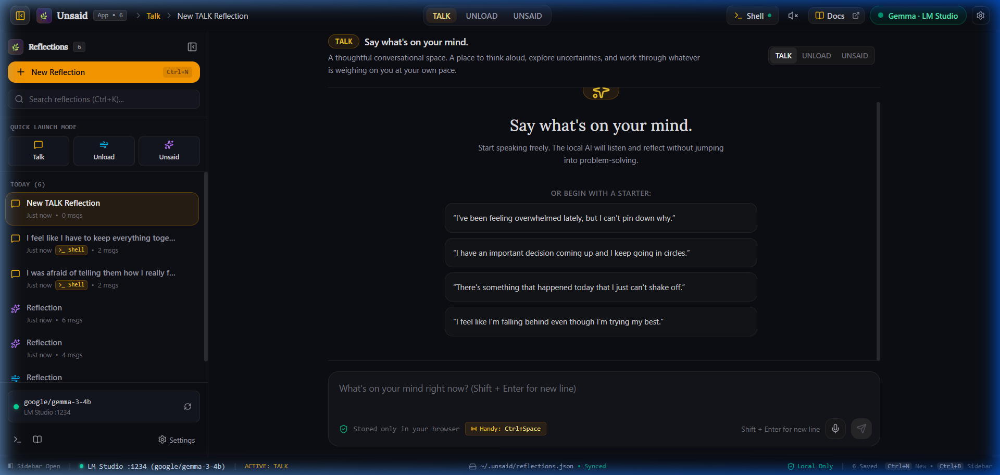
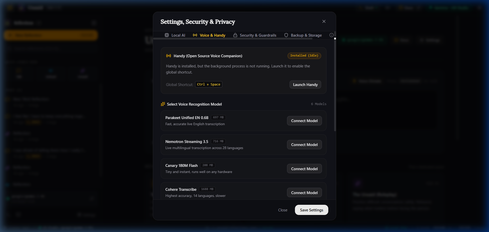
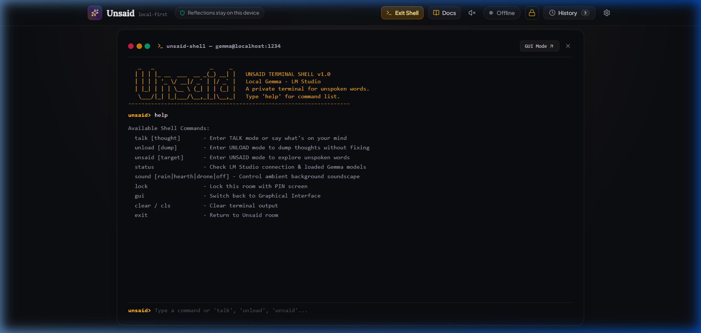
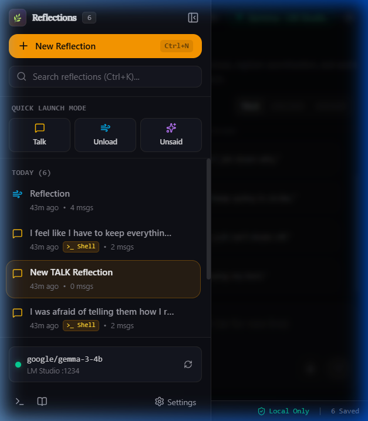

# Unsaid 💭

> **“A private place for the things you don't know how to say out loud.”**  
> *Built for the Hacktoberfest 2026 DEV Weekend Challenge: “Build for a Friend.”*

[](#why-local-ai)
[-amber.svg)](https://lmstudio.ai)
[-sky.svg)](https://github.com/cjpais/Handy)
[](#architecture)
[](LICENSE)

---



---

## Table of Contents
1. [What is Unsaid?](#what-is-unsaid)
2. [Why Local-First AI?](#why-local-first-ai)
3. [Architecture Overview](#architecture-overview)
4. [The Three Reflection Frameworks](#the-three-reflection-frameworks)
5. [Voice Agents & Offline Dictation (Handy)](#voice-agents--offline-dictation-handy)
6. [Unsaid Terminal Shell (CLI)](#unsaid-terminal-shell-cli)
7. [Desktop App & Responsive Experience](#desktop-app--responsive-experience)
8. [Safety, Guardrails & Privacy Engine](#safety-guardrails--privacy-engine)
9. [Documentation Website (`website/`)](#documentation-website-website)
10. [Quick Start & Setup Guide](#quick-start--setup-guide)
11. [Important Boundaries & Non-Goals](#important-boundaries--non-goals)

---

## What is Unsaid?

We all have conversations that linger unresolved in our heads—feelings we aren't ready to share with anyone yet, words we wish we could say to an estranged friend or parent, or thoughts so tangled that speaking them out loud feels daunting.

Most digital journaling tools feel static, while mainstream cloud AI assistants frequently jump into unsolicited 5-step action lists, toxic positivity, or patronizing advice.

**Unsaid** is a private, local-first reflection sanctuary. It pairs an intentional conversational interface with local open-weights intelligence (**Google Gemma 3 4B** via **LM Studio**) and local speech tools (**Handy** offline Whisper) to give you a grounded, confidential sounding board.

---

## Why Local-First AI?

The thoughts we hesitate to say out loud are often our most vulnerable reflections. Sending them to a commercial cloud AI API means trusting remote servers, telemetry trackers, model training pipelines, and centralized databases.

Unsaid is anchored to a strict, non-negotiable architectural contract:

* 🔒 **Zero Telemetry & Zero Cloud Calls:** Unsaid has no tracking pixels, remote database dependencies, or third-party cloud analytics.
* 💻 **Runs 100% On-Device:** All AI inference is performed locally on your GPU/CPU via LM Studio.
* 🎙️ **Private Speech Dictation:** Voice processing runs through open-source offline Whisper models via Handy or your browser's local speech engine.
* 💾 **Dual Local Storage:** Data is stored strictly on your physical machine in browser `localStorage` and optionally synced to `~/.unsaid/reflections.json` for CLI access.
* 🧹 **Instant Purge:** One-click "Delete All Local Data" immediately wipes all local database keys and caches.

---

## Architecture Overview

Unsaid operates through a three-tier local architecture linking a desktop interface, a terminal shell, an offline voice bridge, and a local inference server:

```
┌─────────────────────────────────────────────────────────────────────────────────┐
│                                 UNSAID DESKTOP                                  │
│                          React 19 + TypeScript + Vite                           │
│                                                                                 │
│   ┌───────────────────────────┐  ┌─────────────────────────┐  ┌──────────────┐  │
│   │ Quick Reflection Composer │  │  Framework Navigation   │  │ Letter Studio│  │
│   │ (Ctrl+Enter / Voice Mic)  │  │ (Talk · Unload · Unsaid)│  │ (Facts vs    │  │
│   └─────────────┬─────────────┘  └────────────┬────────────┘  │  Assumptions)│  │
│                 │                             │               └──────────────┘  │
│   ┌─────────────▼─────────────────────────────▼──────────────────────────────┐  │
│   │ Safe Guards & Defense Pipeline                                           │  │
│   │ • Local SHA-256 App Lock PIN        • Prompt Injection & Jailbreak Guard │  │
│   │ • Client-side PII Masker            • Imminent Crisis Intervention Layer │  │
│   └───────────────────────────────────────────┬──────────────────────────────┘  │
│                                               │                                 │
│                   ┌───────────────────────────┴──────────────────────────────┐  │
│                   │ Browser localStorage  ◄──►  ~/.unsaid/reflections.json   │  │
│                   │              (Bidirectional Disk Sync)                   │  │
│                   └───────────────────────────┬──────────────────────────────┘  │
└───────────────────────────────────────────────┼─────────────────────────────────┘
                                                │
                 ┌──────────────────────────────┼──────────────────────────────┐
                 │                              │                              │
                 ▼                              ▼                              ▼
┌──────────────────────────────┐ ┌──────────────────────────────┐ ┌──────────────────────────────┐
│       UNSAID TERMINAL        │ │        HANDY BRIDGE          │ │          LM STUDIO           │
│   Node.js CLI (`npm shell`)  │ │  Offline Whisper Speech-To-  │ │ Local OpenAI-Compatible Server│
│ Realtime disk reflections &  │ │  Text (`Ctrl+Space`) + Gemma │ │   `http://localhost:1234/v1`  │
│ interactive stream session   │ │  Reframing (`Ctrl+Shift+Spc`)│ │    Model: google/gemma-3-4b  │
└──────────────────────────────┘ └──────────────────────────────┘ └──────────────────────────────┘
```

---

## The Three Reflection Frameworks



Unsaid organizes conversations into three distinct rooms, each calibrated with custom system prompts:

### 1. 💬 TALK THROUGH IT — *Say what's on your mind*
* **Purpose:** A calm, paced conversation for working through an active dilemma.
* **Behavior:** Gemma acts as a grounded listener. It mirrors emotional tone, asks clarifying questions, and respects pauses without jumping to quick fixes or solutions.

### 2. 🌬️ JUST UNLOAD — *Stream of consciousness without fixing*
* **Purpose:** For when your mind is racing, overwhelmed, or holding heavy emotions.
* **Behavior:** Unsaid acts as a quiet witness. It holds space, summarizes core themes, and explicitly refrains from offering 5-step action plans or unsolicited advice.

### 3. ✨ THE UNSAID — *Unsent letter & perspective studio*
* **Purpose:** For unspoken thoughts directed toward another person (a friend, partner, parent, coworker, or estranged person).
* **Behavior:** Helps clarify what you actually wish they knew, turns raw emotion into constructive expression, and keeps you anchored to reality.
* **Letter & Perspective Studio:** Includes a dedicated modal that parses your reflections into two clear columns:
  * **Observed Facts:** What happened in the physical world.
  * **Assumptions:** What you are projecting onto their thoughts or intentions.
  * Generates an unsent letter draft for your own closure or future conversation.

---

## Voice Agents & Offline Dictation (Handy)



Speaking out loud often unlocks authentic emotions faster than typing. Unsaid provides a complete, local voice workflow:

### 1. Handy Companion Integration (`cjpais/Handy`)
Unsaid integrates seamlessly with [Handy](https://github.com/cjpais/Handy), an open-source local speech-to-text tool powered by `whisper.cpp` and Vulkan/Metal/CUDA acceleration:
* **Global Shortcut (`Ctrl+Space`):** Press `Ctrl+Space` anywhere in Windows to speak freely; Handy transcribes your words directly into Unsaid's reflection composer.
* **Curated Speech Models:** Select models like **Parakeet Unified EN 0.6B** (~697 MB, recommended for natural conversational flow) or **Canary 180M Flash** (~208 MB for instant zero-lag response) directly inside Unsaid's settings.
* **LM Studio Thought Reframing (`Ctrl+Shift+Space`):** Handy can automatically pipe raw speech transcripts into local Gemma 3 4B to reframe racing thoughts into structured reflections.
* **Honest Process Detection:** Unsaid monitors whether Handy is **Not Installed**, **Installed (Idle)**, or **Active & Running**—never displaying misleading connected badges or hotkey prompts if the application is not running.

### 2. Zero-Download Built-in Microphone
Don't want to install external software? Click **Voice Dictate** in the composer to use Unsaid's built-in browser speech recognition (`InAppSpeechRecognizer`) with zero downloads or configuration.

### 3. Voice Agent (Read Aloud)
Listen to your reflections read aloud with Unsaid's procedural text-to-speech player (`voiceAgent.ts`), allowing you to step back and hear your own thoughts from a third-person perspective.

---

## Unsaid Terminal Shell (CLI)



Prefer living in the terminal? Unsaid includes a complete terminal client built with Node.js, Chalk, and Ink:

```bash
# Launch the interactive terminal shell
npm run shell
```

* **Interactive Reflection Sessions:** Start Talk, Unload, or Unsaid sessions directly inside your terminal with real-time text streaming.
* **Bi-directional Disk Sync:** CLI reflections save instantly to `~/.unsaid/reflections.json` and sync with the desktop app in real time via Server-Sent Events (SSE).
* **Terminal Commands:**
  ```bash
  unsaid talk       # Start a guided reflection session
  unsaid unload     # Dump stream-of-consciousness thoughts
  unsaid unsaid     # Practice difficult unspoken conversations
  unsaid history    # Browse past saved reflections in your terminal
  unsaid export     # Export all notes to markdown files
  ```

---

## Desktop App & Responsive Experience



Unsaid is designed to feel like a premium, native desktop application while remaining fully responsive across tablets, foldables, and mobile screens:

* **Desktop Application Window:** Launch with `start-desktop.bat` or `npm run desktop` to run in a dedicated, chromeless native window.
* **Collapsible Desktop Sidebar:** Quick access to all three modes, recent reflection history, documentation, and settings.
* **Mobile Slide-Over Navigation:** Smooth touch-friendly drawer on smaller screens with backdrop blur.
* **Native Desktop Status Bar:** Displays LM Studio connection status, active model (`Gemma 3 4B`), local storage indicators, reflection counts, and shortcut hints (`Ctrl+B`, `Ctrl+N`).

---

## Safety, Guardrails & Privacy Engine

Because reflections can touch on sensitive topics, Unsaid includes five client-side safety guardrails:

1. **Local App Lock (PIN Protection):**
   * Encrypt your local session with a 4–8 digit PIN hashed locally with salted **SHA-256**.
   * Configurable inactivity auto-lock (1 min, 5 min, 15 min, 1 hr).
2. **Prompt Injection & Clinical Boundary Defense:**
   * Detects adversarial system overrides, role reversal jailbreaks, and requests for clinical psychiatric diagnoses.
   * Gracefully redirects back to personal, non-clinical reflection.
3. **Client-Side PII Masker:**
   * Scrub real names, email addresses, phone numbers, and identifying credentials before they touch the model or local disk.
4. **Crisis Safety Intervention Layer:**
   * Intercepts explicit self-harm or crisis ideation, stops AI generation, and delivers 24/7 confidential crisis helplines (988 US/CA, Crisis Text Line 741741, UK 111/116 123, and [findahelpline.com](https://findahelpline.com)).
5. **Procedural Ambient Soundscapes:**
   * Built-in Web Audio API sound synthesizer with zero external audio assets:
     * 🌧️ **Gentle Rain** (Brownian noise filter)
     * 🔥 **Warm Hearth** (Perlin crackle synthesizer)
     * 🎶 **Serene Drone** (Binaural sine wave chord)

---

## Documentation Website (`website/`)

The repository includes a standalone documentation website in the `/website` directory:
* **Interactive Guide:** Step-by-step instructions for setting up LM Studio, choosing Gemma models, and configuring Handy.
* **Prompt Engineering Reference:** Complete transparency into the system prompts and emotional guardrails powering each reflection mode.
* **Offline Access:** Open `website/index.html` in any browser or click **Docs & Guides** inside the desktop app.

---

## Quick Start & Setup Guide

### Prerequisites
1. **Node.js** (v18 or higher)
2. **LM Studio** ([lmstudio.ai](https://lmstudio.ai))
3. An open **Gemma** model loaded in LM Studio (recommended: `google/gemma-3-4b` or `gemma-2-2b-it`)
4. *(Optional)* **Handy** ([github.com/cjpais/Handy](https://github.com/cjpais/Handy)) for offline `Ctrl+Space` dictation.

---

### Step 1: Clone & Install

```bash
git clone https://github.com/your-username/unsaid.git
cd unsaid
npm install
```

---

### Step 2: Configure LM Studio

1. Open **LM Studio** and search for **Gemma 3 4B** (`google/gemma-3-4b`).
2. Download the model (the `Q4_K_M` or `Q8_0` GGUF quantization is recommended).
3. Navigate to the **Developer / Local Server** tab (the `<->` icon on the left bar).
4. Select `google/gemma-3-4b` from the top dropdown and click **Start Server**.
5. Server will listen on `http://localhost:1234/v1`.

---

### Step 3: Run Unsaid

**Option A: Dedicated Desktop Window (Windows)**
```bash
# Double click start-desktop.bat or run:
npm run desktop
```

**Option B: Web Browser**
```bash
npm run dev
# Open http://localhost:5173
```

**Option C: Terminal Shell (CLI)**
```bash
npm run shell
```

---

## Important Boundaries & Non-Goals

* **Not Mental Health Care:** Unsaid is **not** an AI therapist, licensed counselor, psychologist, medical diagnostic tool, or clinical intervention.
* **No Prescriptive Diagnosis:** Unsaid will never diagnose mental conditions or prescribe treatment.
* **Reflection, Not Authority:** Unsaid is an automated companion designed to help you clarify your own feelings before taking action in your real life.

---

## License

MIT License. Built with ❤️ for friends who need a safe place for the things left unsaid.